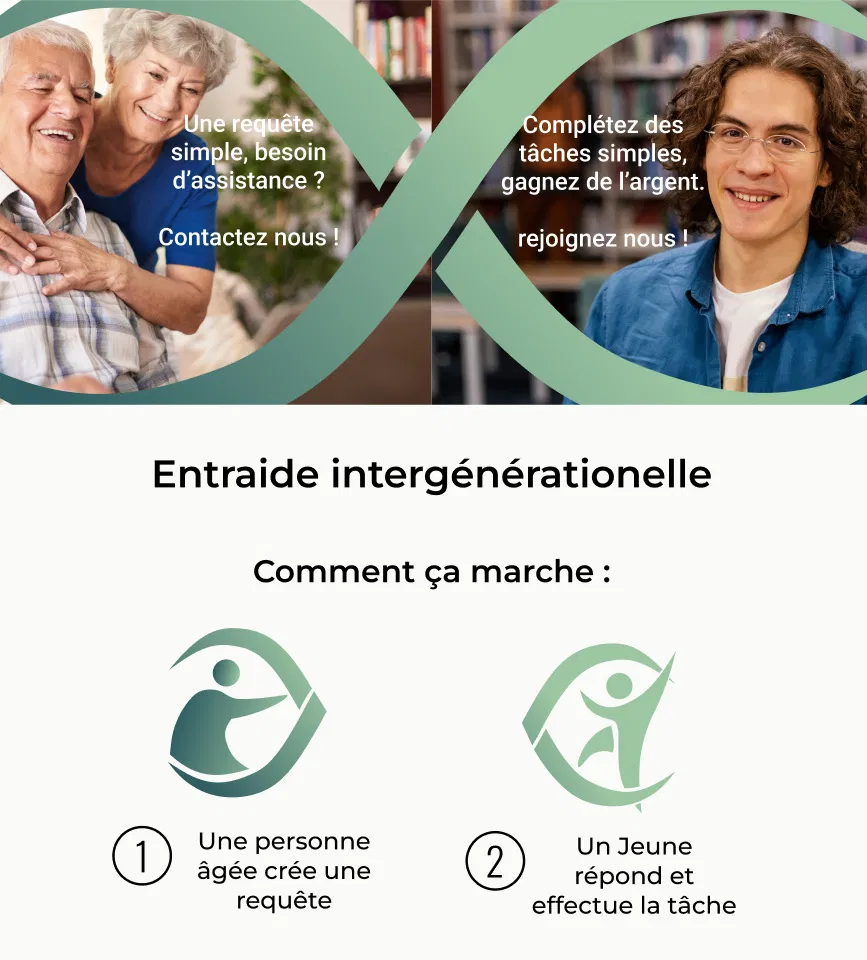
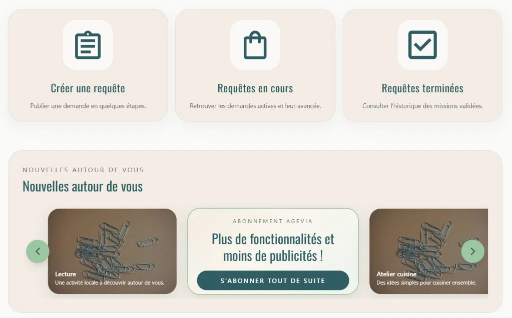

# Projet collectif S.2

Éléménts à renseigner pour la soutenance :

- [x] Nom du projet : Agevia
- [x] URL de la landing page : https://agevia.merlinhenry.fr/landing/
- [x] URL de l'application finale (netlify) : https://cozy-buttercream-4eaf40.netlify.app/
- [x] URL de connexion au back office : http://127.0.0.1:8090/_/ 
- [x] Identifiant de connexion au backoffice : g75835552@gmail.com
- [x] Mot de passe de connexion au backoffice : pujgix-beprA2-zocrav 
- [x] URL de la maquette FIGMA : https://www.figma.com/design/fpIEoimIHLK8zNJHMRD3qw/Agevia-maquette---guide-de-style?node-id=0-1&t=zbeDfSQap80YV4FT-1
- [x] Description du projet : voir ci-dessous

---

## 📖 Description

**Agevia** est une plateforme d'entraide intergénérationnelle qui met en relation des **seniors** ayant besoin d'aide au quotidien avec des **étudiants** motivés cherchant des missions ponctuelles rémunérées.

L'objectif est double : lutter contre l'isolement des personnes âgées, tout en offrant aux étudiants en situation de précarité une source de revenus flexible et compatible avec leurs études.

### Comment ça marche

Les seniors publient une requête simple (courses, jardinage, compagnie, aide administrative…). Les étudiants consultent les annonces disponibles et candidatent aux missions qui leur correspondent.

### Fonctionnalités principales

- 📋 **Créer une requête** — publier une demande en quelques étapes
- 🔄 **Requêtes en cours** — suivre l'avancement des missions actives
- ✅ **Requêtes terminées** — consulter l'historique des missions validées
- 🗺️ **Nouvelles autour de vous** — découvrir des activités et missions locales
- 💳 **Abonnement Agevia** — accès à plus de fonctionnalités, moins de publicités

---

## 🚀 Équipe

| Étudiants    | Prénom NOM       |
| :----------- | :--------------- |
| Étudiant 1   | Merlin Henry     |
| Étudiant 2   | Théo Philbert    |
| Étudiant 3   | Lucile Prothon   |
| (Étudiant 4) | à compléter      |
